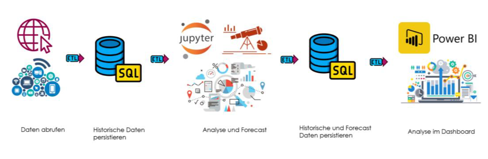
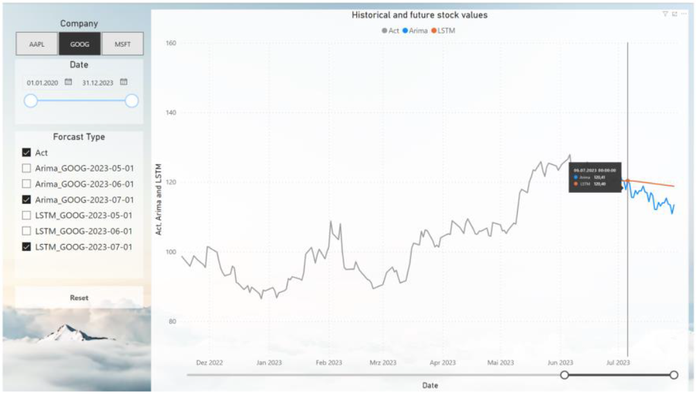

Hier ist eine überarbeitete Version der README mit den bisherigen Informationen und zusätzlichen Details aus dem Onepager integriert:

---

# Studienprojekt "Zeitreihenanalyse mit Methoden des Maschinellen Lernens"  
# Study Project "Time Series Analysis with Machine Learning Methods"

---

### Deutsche Fassung (English version below)

### Projektübersicht

Das Ziel dieses Studienprojekts ist es, zukünftige Aktienkurse auf Grundlage historischer Daten mithilfe von Methoden des Maschinellen Lernens (ML) vorherzusagen. Angesichts der zunehmenden Volatilität der Aktienmärkte bietet das Projekt Ansätze, um zukünftige Marktbewegungen präziser zu prognostizieren.  

Bei Interesse kann die gesamte Dokumentation der Arbeit zur Verfügung gestellt werden. Kontakt: **alw.star@proton.me**

---

### Technische Architektur

- **Datenerhebung**: Historische Aktienkurse werden über die **Yahoo Finance API** mithilfe der Python-Bibliothek `yFinance` gesammelt.
- **Datenspeicherung**: Die gesammelten Daten werden in einer **SQL-Datenbank** persistiert.
- **Datenverarbeitung**: Daten werden in **Jupyter Notebooks** geladen und mithilfe von ML-Methoden analysiert.
- **Visualisierung**: Die Ergebnisse werden in **Power BI** aufbereitet und visualisiert.

---

### Datenset und ETL-Prozess

- **ETL-Schritte**:
  1. Anlegen von Tabellen in der SQL-Datenbank.
  2. Persistieren historischer Aktienkursdaten.
  3. Laden der Daten für Analysen.
  4. Bereinigung und Management von Duplikaten.

---

### Methodologische Ansätze

- **ARIMA (Autoregressive Integrated Moving Average)**:
  - Ein statistisches Modell, das sich auf die Vorhersage univariater Zeitreihen spezialisiert.
- **LSTM (Long Short-Term Memory)**:
  - Ein Deep-Learning-Modell, das sich besonders für sequenzielle, multivariate Daten eignet.

---

### Visualisierung und Analyse

Das Projekt schließt mit einem interaktiven **Power BI Dashboard**, das eine effektive Visualisierung und Analyse der Prognosedaten ermöglicht.  

---

### Schlussfolgerungen

Dieses Studienprojekt zeigt die Kombination klassischer statistischer und moderner Deep-Learning-Ansätze zur Vorhersage von Aktienkursen auf. Die Arbeit liefert ein nützliches Werkzeug für Anleger, um datenbasierte Entscheidungen in einem unsicheren Marktumfeld treffen zu können.

---

## English Version

### Project Overview

This study project aims to predict future stock prices using historical data and machine learning (ML) methods. In light of increasing stock market volatility, the project provides approaches for more precise predictions of future market movements.  

If interested, the full documentation of the work can be made available. Contact: **alw.star@proton.me**

---

### Technical Architecture

- **Data Collection**: Historical stock prices are gathered via the **Yahoo Finance API** using Python’s `yFinance` library.
- **Data Storage**: Collected data is stored in an **SQL database**.
- **Data Processing**: Data is loaded into **Jupyter Notebooks** and analyzed using ML methods.
- **Visualization**: Results are processed and visualized in **Power BI**.

---

### Dataset and ETL Process

- **ETL Steps**:
  1. Creating tables in the SQL database.
  2. Persisting historical stock price data.
  3. Loading data for analysis.
  4. Cleaning and managing duplicates.

---

### Methodological Approaches

- **ARIMA (Autoregressive Integrated Moving Average)**:
  - A statistical model specialized in forecasting univariate time series.
- **LSTM (Long Short-Term Memory)**:
  - A deep learning model well-suited for sequential, multivariate data.

---

### Visualization and Analysis

The project concludes with an interactive **Power BI Dashboard**, enabling effective visualization and analysis of prediction data.

---

### Conclusions

This study project demonstrates the combination of classical statistical and modern deep-learning approaches for predicting stock prices. It offers a useful tool for investors to make data-driven decisions in an uncertain market environment.

---

Diese README kombiniert den bisherigen Inhalt mit einer klar strukturierten Darstellung und fügt Details aus dem PDF hinzu.